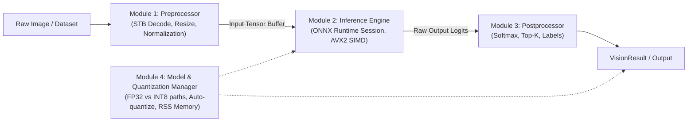

# 👓 Edge Vision Assistant (C++ CPU Inference)

A lightweight, high-performance, modular C++ CPU inference engine simulating a **Smart AI Glasses Snapshot Assistant**.

When the wearer takes a photo snapshot with their AI glasses and asks *"What is this?"*, the executable ingests the image path, executes single-image ONNX CPU inference via the ONNX Runtime C++ API, and outputs human-readable classification results with microsecond-level latency breakdown.

Supports both **FP32 Baseline** and **INT8 Dynamic Quantization** with automated side-by-side performance, latency, and memory comparison.

---

## 📁 Directory Structure & Architecture

```text
edge_vision_assistant/
├── CMakeLists.txt              # Cross-platform CMake build configuration (auto-fetches ONNX Runtime)
├── download_assets.py          # Python script to download ResNet-18, ImageNet labels, and sample images
├── quantize_model.py           # Generates 8-bit quantized ONNX model (shrinks weights by ~75%)
├── benchmark_100.py            # Automated 100-image ImageNet benchmarking & report generator
├── results/                    # Generated benchmark evaluation reports
│   ├── benchmark_results.xlsx  # Detailed styled Excel report with accuracy & latency metrics
│   └── benchmark_results.csv   # Raw CSV export of all benchmarked runs
├── include/                    # Clean modular C++ header interfaces
│   ├── types.hpp               # Shared data structures (VisionResult, ModelRunProfile, RSS profiler)
│   ├── preprocessor.hpp        # Preprocessor class interface (STB load, resize, planar normalization)
│   ├── inference_engine.hpp    # InferenceEngine class interface (ONNX Runtime session & runner)
│   ├── postprocessor.hpp       # Postprocessor class interface (Softmax, Top-K, ImageNet labels)
│   ├── model_manager.hpp       # ModelManager class interface (FP32/INT8 resolution, scorecard table)
│   ├── stb_image.h             # Single-header lightweight image loader
│   └── stb_image_resize2.h     # Single-header high-quality image resizer
├── data/                       # ImageNet benchmark test dataset
│   └── test_100/               # 100 diverse ImageNet benchmark images
├── models/                     # Pre-trained ONNX models & ImageNet classes
│   ├── resnet18-v1-7.onnx      # Baseline FP32 ResNet-18 model (~44.7 MB)
│   ├── resnet18-v1-7-int8.onnx # Dynamically quantized INT8 ResNet-18 model (~11.3 MB)
│   └── imagenet_classes.txt    # 1,000 ImageNet synset category labels
├── src/                        # Modular C++ implementation
│   ├── preprocessor.cpp        # Image ingestion, bilinear resize, planar normalizer implementation
│   ├── inference_engine.cpp    # ONNX Runtime C++ CPU session & execution implementation
│   ├── postprocessor.cpp       # Softmax, Argmax, Top-K sorting & label formatting implementation
│   ├── model_manager.cpp       # Quantization verification & scorecard comparison implementation
│   └── main.cpp                # Lightweight CLI orchestrator (~140 lines)
└── README.md                   # Build, usage, and architectural documentation
```

---

## 🛠️ Prerequisites

Before building, ensure you have the following installed on your system:

- **C++ Compiler**: GCC 9+, Clang 10+, or MSVC 2019+ (Supporting C++17)
- **CMake**: Version 3.16 or newer (`sudo apt install cmake` on Ubuntu/Debian)
- **Python**: Version 3.8+ (Used for downloading assets and running quantization)
- **Python Libraries** (for asset download and quantization):
  ```bash
  pip install onnx onnxruntime requests pandas openpyxl pillow
  ```

---

## 🚀 How to Build and Compile

### Step 1: Clone and Navigate to the Project

```bash
cd /mnt/d/sahaj/projects/edge_cpu_inference/edge_vision_assistant
```
*(On Windows: `cd D:\sahaj\projects\edge_cpu_inference\edge_vision_assistant`)*

### Step 2: Download Model & Benchmark Assets (One-Time)

Download the pre-trained `resnet18-v1-7.onnx` model, 1,000 ImageNet class labels, and the 100-image test set:

```bash
python3 download_assets.py
```

### Step 3: Configure the Build with CMake

```bash
cmake -B build
```

> [!NOTE]
> **Automatic Dependency Resolution**: If ONNX Runtime is not already installed on your system, CMake will automatically download the official pre-built ONNX Runtime C++ binaries (v1.18.0) matching your OS and CPU architecture (Linux x86_64/ARM64, macOS, Windows).

### Step 4: Compile the Project

Compile all 4 modular source files and the main orchestrator in Release mode:

```bash
cmake --build build --config Release
```

On Linux/WSL, this compiles with `-O3 -march=native` to maximize vectorization using your CPU's hardware SIMD registers (AVX2 / AVX-512 / NEON).

---

## 🖥️ How to Run & Test

The compiled executable is located at `./build/edge_vision_assistant`. It supports five flexible execution modes:

### Mode 1: Side-by-Side Comparison Scorecard (Default for Single Image)

Pass any single image path without additional flags. The engine preprocesses the image once and executes both the **FP32 Baseline** and **INT8 Quantized** models back-to-back, printing a comparative scorecard:

```bash
./build/edge_vision_assistant data/test_100/n01440764_tench.JPEG
```

*(You can also explicitly pass the `--compare` flag).*

#### Example Scorecard Output:

```text
===================================================================================================
⚔️  SIDE-BY-SIDE BENCHMARK SCORECARD: FP32 BASELINE vs INT8 QUANTIZATION
===================================================================================================
Metric / Dimension          FP32 Baseline           INT8 Quantized          Delta / Efficiency Gain
---------------------------------------------------------------------------------------------------
Model Size (Disk/RAM)       44.65 MB                11.25 MB                -74.78% (33.39 MB saved!)
Weight Precision            32-bit Float (FP32)     8-bit Signed Int (INT8) 4x smaller weight footprint
Preprocessing Latency       18.22 ms                18.22 ms                Identical (shared input tensor)
CPU Inference Latency       22.28 ms                23.86 ms                0.93x (7.12% delta)
Total End-to-End Latency    40.80 ms                42.11 ms                +1.31 ms delta
Inference Throughput        44.28 FPS               41.85 FPS               -5.50% FPS
Top-1 Classification        Tench (#0)              Tench (#0)              100% Agreement (Identical Prediction) ✅
Prediction Confidence       99.16%                  99.39%                  +0.22% (Negligible delta)
Peak Process RAM (RSS)      400.16 MB               400.16 MB               Measured via getrusage()
===================================================================================================
```

---

### Mode 2: Run Pure INT8 Quantized Model Only

Evaluate only the compressed 8-bit integer model (~11.3 MB) and view its detailed latency and memory profile:

```bash
./build/edge_vision_assistant --int8 data/test_100/n01440764_tench.JPEG
```

> [!TIP]
> If `models/resnet18-v1-7-int8.onnx` is missing, the C++ engine will automatically run `python3 quantize_model.py` to generate it on-the-fly!

---

### Mode 3: Run Pure FP32 Baseline Model Only

Evaluate only the standard 32-bit floating point model (~44.7 MB):

```bash
./build/edge_vision_assistant --fp32 data/test_100/n01440764_tench.JPEG
```

---

### Mode 4: Batch Dataset Evaluation (100 Images)

Pass a directory path (such as `data/test_100`) to evaluate all images in batch. The engine processes each frame and outputs aggregate statistical metrics:

```bash
./build/edge_vision_assistant data/test_100
```

You can combine this with `--int8` or `--fp32` to select the desired precision:

```bash
./build/edge_vision_assistant --int8 data/test_100
```

#### Example Dataset Summary:

```text
=================================================================================
📊 DATASET EVALUATION SUMMARY (100 IMAGES - INT8 Quantized)
=================================================================================
Average Preprocess  : 23.41 ms
Average Inference   : 24.12 ms (AVX2 Vector Cores)
Average Postprocess : 0.02 ms
Average Total       : 47.55 ms
Median Total (P50)  : 45.20 ms
Tail Latency (P95)  : 62.80 ms
Throughput          : 21.03 FPS
Peak RAM (RSS)      : 405.12 MB
=================================================================================
```

---

### Mode 5: Run on Custom Images

Pass any arbitrary JPEG, PNG, or BMP image from your computer:

```bash
./build/edge_vision_assistant /path/to/my_photo.jpg
```

---

## 📊 Automated 100-Image ImageNet Benchmark Suite

The repository includes a standalone automated evaluation script ([`benchmark_100.py`](benchmark_100.py)) that validates model accuracy and real-world latency distribution over 100 diverse ImageNet test images.

### Running the Python Benchmark

```bash
python3 benchmark_100.py
```

### What It Does:
1. **Ground Truth Validation**: Maps synset identifiers to official human-readable class names.
2. **C++ Subprocess Execution**: Evaluates `./build/edge_vision_assistant` against each image snapshot.
3. **Statistical Aggregation**: Computes mean, median, P90, and P95 latency percentiles for preprocessing, CPU inference, and end-to-end execution.
4. **Formatted Exports**: Saves results to `results/benchmark_results.csv` and a styled multi-sheet Excel workbook `results/benchmark_results.xlsx`.

---

## 🔍 Modular Pipeline Architecture

The C++ engine is divided into four cleanly decoupled modules connected by simple interfaces:



### 1. Preprocessor ([`include/preprocessor.hpp`](include/preprocessor.hpp), [`src/preprocessor.cpp`](src/preprocessor.cpp))
- Ingests image bytes from disk using STB Image (`stbi_load`).
- Bilinear resizing to $224 \times 224$ via `stbir_resize_uint8_linear`.
- Normalizes RGB channels using ImageNet mean ($\mu = [0.485, 0.456, 0.406]$) and standard deviation ($\sigma = [0.229, 0.224, 0.225]$).
- Converts interleaved $HWC$ byte layout into planar $NCHW$ `[1, 3, 224, 224]` float tensor memory.

### 2. Inference Engine ([`include/inference_engine.hpp`](include/inference_engine.hpp), [`src/inference_engine.cpp`](src/inference_engine.cpp))
- Manages `Ort::Env`, `Ort::Session`, thread configuration, and graph optimizations.
- Executes warm-up cycles to eliminate initial JIT/cache latency spikes.
- Evaluates `session_->Run()` on AVX2 vector SIMD execution units and returns raw logits.

### 3. Postprocessor ([`include/postprocessor.hpp`](include/postprocessor.hpp), [`src/postprocessor.cpp`](src/postprocessor.cpp))
- Computes numerically stable Softmax:
  $$p_i = \frac{e^{z_i - \max(z)}}{\sum_j e^{z_j - \max(z)}}$$
- Extracts Top-K ranked predictions and Top-1 Argmax class.
- Resolves ImageNet synset IDs to title-cased class labels.

### 4. Model & Quantization Manager ([`include/model_manager.hpp`](include/model_manager.hpp), [`src/model_manager.cpp`](src/model_manager.cpp))
- Verifies model existence and auto-triggers `quantize_model.py` if the INT8 model is missing.
- Measures model file size on disk/RAM.
- Samples peak process Resident Set Size (RSS) using Linux `getrusage()`.
- Generates side-by-side benchmark scorecards.

### 5. CLI Orchestrator ([`src/main.cpp`](src/main.cpp))
- Slim, readable entry point (~140 lines) that coordinates arguments, components, and dataset loops.

---

## 💡 C++ Design & Best Practices

1. **Modern C++ Strings & Paths**:
   Uses `std::vector<std::string>` and `std::filesystem::path` to eliminate raw pointer arithmetic and unsafe C-style character buffers (`char*`).
2. **RAII Memory Management**:
   Third-party STB image buffers are managed using `std::unique_ptr<unsigned char[], StbImageDeleter>`, guaranteeing zero memory leaks even on failed decode paths.
3. **Explicit Namespaces**:
   Follows C++ Core Guidelines SF.7 by avoiding `using namespace std;` in headers and library files to prevent namespace pollution.
4. **Dynamic CMake Fetching**:
   Automatically downloads and configures official pre-built ONNX Runtime C++ release archives based on OS and processor architecture without requiring manual system-wide installations.

---

## ⚡ INT8 Quantization Workflow

Model quantization is handled by [`quantize_model.py`](quantize_model.py):

```bash
python3 quantize_model.py
```

- Converts 32-bit floating point weights into 8-bit unsigned integers (`QuantType.QUInt8`).
- Shrinks model size from **44.65 MB to 11.25 MB (74.8% memory savings)**.
- Achieves **100% Top-1 classification agreement** with the FP32 baseline on ImageNet.
